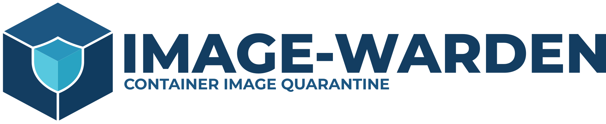
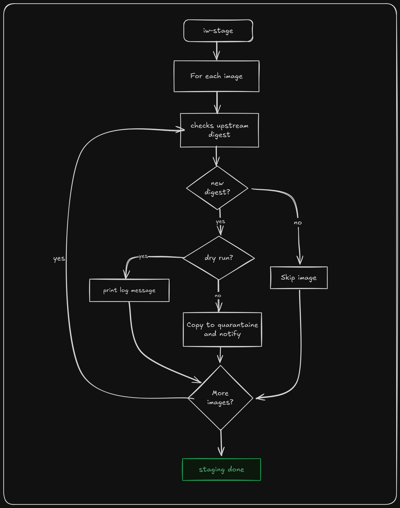
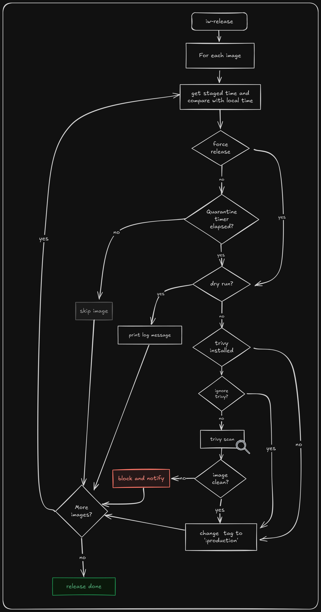
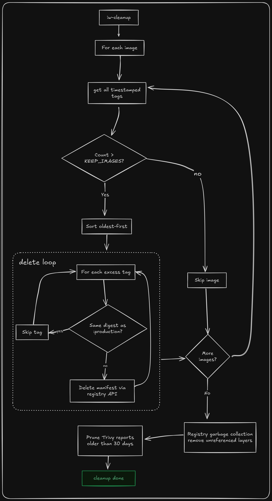

<h1 align="center">

[](LICENSE)
</h1>

Running and auto-updating containers on `:latest` or mutable version tags can be a security risk. Recent supply-chain attacks have proven that over and over again. While pinning by SHA digest is the only truly immutable solution, managing those digests manually creates friction and ain't nobody got time for that. At least I don't.

Image-Warden aims to automate the secure middle path. Every configured upstream image is automatically pulled by digest into a (local) staging registry and held for a configurable quarantine period (default 72h). This time delay is crucial to protect against upstream compromise or exploits that haven't reached CVE databases or hit the news yet. After the quarantine timer expires, the image is automatically scanned by [Trivy](https://github.com/aquasecurity/trivy) and will be promoted to `:production` if the scan comes back clean. Once an image safely passes quarantine, native tools like [Podman's `AutoUpdate=registry`](https://docs.podman.io/en/latest/markdown/podman-auto-update.1.html) can handle the container restart automatically.

## Disclaimer

This project is work in progress and was written with a focus on podman because that is what I primarily use. The scripts do work with docker installations, but I have not tested automatic updating and restarting Docker containers extensively.

Image-Warden adds a safety net, not a safety guarantee. It's merely a speed bump for bad images, not a substitute for common sense, coffee, and actually reading changelogs and Hacker News.

## How it works

Image-Warden primarily consists of the following scripts:

| Script name    | What it does |
| -------- | ----------------------------------------------------------------------------------------------------------------------------------------------------------------------------------------------------------------------------------- |
| iw-stage       | Compares the digest of each tracked upstream repository with the local one. Pulls new images and tags them with the upstream tag and creation date.                                                                                 |
| iw-release     | Checks the time in quarantine for staged images. If quarantine is up scans the image with `trivy` for known CVE and promotes it to `:production` if the scan is clean. Can also be run manually to force release of an image and ignore `trivy` results. |
| iw-cleanup     | Removes images that are out of the configured retention. Removes unreferenced layers using registry garbage collection.                                                                                                             |
| iw-notify-test | Sends a test notification to all enabled notification backends.                                                                                                                                                                     |

You can run the scripts manually or set up automation with systemd timers or cron. I've included my `.timer` and `.service` unit files in  the `systemd` directory as example. Those won't get installed automatically. See commented section in `install.sh`. My schedule from these:

| Timer                | Schedule   | What it does                                              |
| -------------------- | ---------- | --------------------------------------------------------- |
| `iw-stage.timer`     | daily      | Pulls new upstream digests into local staging tags         |
| `iw-release.timer`   | every 6 h  | Runs Trivy, promotes clean images to `:production`        |
| `iw-cleanup.timer`   | weekly     | Removes outdated staging tags, runs registry GC            |

## Somewhat detailed Flowcharts

<details>
<summary>click me</summary>

### `iw-stage`



### `iw-release`



### `iw-cleanup`



</details>

## Requirements

- Linux with systemd user services
- a OCI Distribution registry
- `skopeo`, `jq`, `curl`
- **Podman** or **Docker**, ideally with a container restart tool: [Podman `AutoUpdate=registry`](https://docs.podman.io/en/latest/markdown/podman-auto-update.1.html), 
  [Dockhand](https://github.com/dockhand/dockhand), [What's Up Docker](https://github.com/fmartinou/whats-up-docker),
  or [Watchtower (Fedor fork)](https://github.com/nicholas-fedor/watchtower)
- `trivy`, optional but strongly recommended. Trivy installation: <https://trivy.dev/docs/latest/getting-started/installation/>

## Installation

```bash
git clone https://github.com/image-warden/image-warden.git
cd image-warden
bash install.sh
```

The installer checks for missing dependencies, copies scripts and the notification library to their directories, creates symlinks in `~/.local/bin/`, ~~installs systemd user units, reloads systemd user daemon~~ (currently disabled because not everyone is using systemd timers) and writes default config files.

Re-run `bash install.sh` at any time to update scripts and units after a
`git pull`. Existing config and secrets files are never overwritten.

<details>
<summary>Manual installation without running install.sh</summary>

```bash
# 1. Create directories
mkdir -p ~/.local/share/image-warden/{bin,lib}
mkdir -p ~/.local/bin
mkdir -p ~/.config/image-warden
mkdir -p ~/.config/systemd/user

# 2. Install scripts and library
install -m 0755 bin/iw-*   ~/.local/share/image-warden/bin/
install -m 0644 lib/notify.sh ~/.local/share/image-warden/lib/

# 3. Create symlinks
ln -sf ~/.local/share/image-warden/bin/iw-stage    ~/.local/bin/iw-stage
ln -sf ~/.local/share/image-warden/bin/iw-release  ~/.local/bin/iw-release
ln -sf ~/.local/share/image-warden/bin/iw-cleanup  ~/.local/bin/iw-cleanup
ln -sf ~/.local/share/image-warden/bin/iw-notify-test  ~/.local/bin/iw-notify-test

# 4. Install config (skip if you already have one)
cp config/image-warden.conf.example ~/.config/image-warden/image-warden.conf
install -m 0600 config/secrets.example ~/.config/image-warden/secrets

# 5. Optional: Install systemd user units
install -m 0644 systemd/iw-{stage,release,cleanup}.{service,timer} \
    ~/.config/systemd/user/
systemctl --user daemon-reload
```

Ensure `~/.local/bin` is in your `PATH`:

```bash
# add to ~/.bashrc or ~/.zshrc if missing
export PATH="$HOME/.local/bin:$PATH"
```

</details>

## Configuration

### 1. Set up a staging registry

Image-Warden needs a (local) OCI Distribution registry. If you don't already have one you can orient yourself on the provided files in the systemd directory:

**Podman (Quadlet):**

```bash
# edit Volume= paths first
vi systemd/staging-registry.container

cp systemd/staging-registry.container \
   ~/.config/containers/systemd/staging-registry.container

systemctl --user daemon-reload
systemctl --user enable --now staging-registry.service
```

**Docker (Compose):**

```bash
# edit volume paths first
vi systemd/staging-registry.compose.yml

docker compose -f systemd/staging-registry.compose.yml up -d
```

See [docs/registry-config.md](docs/registry-config.md) for `config.yml` examples (including enabling deletion for garbage collection).

### 2. Configure Image-Warden and upstream images

Edit `~/.config/image-warden/image-warden.conf`:

```bash
# Quarantine duration
QUARANTINE_HOURS=72

# Your local registry
LOCAL_REGISTRY="localhost:5000"
LOCAL_REGISTRY_TLS_VERIFY=false   # true for HTTPS enabled registries

# Container name of the staging registry (for garbage collection in iw-cleanup)
REGISTRY_CONTAINER_NAME="staging-registry"

# Trivy severity gate
TRIVY_SEVERITY="CRITICAL,HIGH"

# Tracked images
# Format: upstream_ref|local_name[|trivy_severity_override[|notify_only]]
IMAGES=(
  "ghcr.io/advplyr/audiobookshelf:latest|audiobookshelf"
  "docker.io/library/nginx:stable|nginx|CRITICAL"
  "docker.io/library/alpine:latest|alpine|CRITICAL,HIGH|notify_only"
)
```

**First run behaviour:** any image in `IMAGES` that has no local state yet is
staged immediately on the next `iw-stage` run - no separate initialisation step needed. The quarantine clock starts from that first stage.

### 3. Configure notifications (optional)

Edit `~/.config/image-warden/secrets`:

```bash
DISCORD_WEBHOOK_URL="https://discord.com/api/webhooks/..."
SLACK_WEBHOOK_URL="https://hooks.slack.com/services/..."
[...]
```

Edit `~/.config/image-warden/image-warden.conf`:

```bash
# One or more backends: discord slack teams telegram ntfy
NOTIFY_BACKENDS=(discord ntfy)
```

See the [secrets example](config/secrets.example) for all supported backends.

### 4. Point your containers at the staging registry

**Podman (Quadlet):**

```ini
# Before
[Container]
Image=docker.io/library/nginx:stable
AutoUpdate=registry

# After
[Container]
Image=localhost:5000/nginx:production
AutoUpdate=registry
```

Podman detects when `iw-release` copies a new digest to `:production` and
restarts the container automatically.

**Docker (Compose):**

```yaml
services:
  nginx:
    image: localhost:5000/nginx:production
```

> For `localhost:5000` without TLS you must mark the registry as insecure otherwise you end up getting errors like this:
>
> ```
> WARNING: API delete failed! Registry may not have deletion enabled
> ```
>
> For **Podman** edit `~/.config/containers/registries.conf`:
>
> ```toml
> [[registry]]
> location = "localhost:5000"
> insecure = true
> ```
>
> For **Docker** edit `/etc/docker/daemon.json`:
>
> ```json
> { "insecure-registries": ["localhost:5000"] }
> ```

## Uninstall

```bash
bash install.sh --uninstall
```

Config, state, and cache directories are preserved. Remove them manually if no
longer needed.

## To-do list

In no particular order:

- ~~cool logo!~~
- image-warden container deployment
- set up TLS for (local) registry
- add authentication to (local) registry
- Web-UI (really low prio atm tbh)
- troubleshooting document
- add grype support
- switch over to python?
- use database instead of flat files

## License

MIT + Commons Clause - see [LICENSE](LICENSE).

Free for personal, internal, and non-commercial use. Selling the software or offering it as a paid hosted service requires explicit permission from the author.
